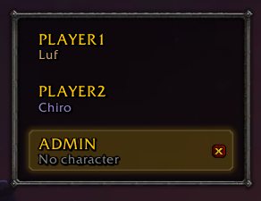

# comfylogin

> **Bugs, questions and screenshots: [join our Discord](https://discord.gg/uhefX2efB7).**
>
> 

Saved accounts on the login screen, and your characters in the order you want. For 1.12 clients: Turtle WoW, OctoWoW and the stock 1.12.1 client.

## Features

- **Saved accounts.** Your accounts are listed on the login screen. Click one to fill in the name and password. Double click to log in.
- **Character order.** Hover over a character and click the arrows to move it.
- **Auto login.** Tick **Auto login** beside **Enter World**, and that account goes straight to that character.

Each login that works is added to the list. The x on a row removes it.

## Install

It needs [VanillaFixes](https://github.com/hannesmann/vanillafixes), which loads the DLL. Turtle WoW and OctoWoW come with it: look for `VanillaFixes.exe` and `dlls.txt` in the client folder.

1. Download `comfylogin.zip` from [Releases](https://github.com/aloofbit/comfylogin/releases/latest).
2. Close the game.
3. Extract the zip into the client folder, the folder with `WoW.exe`. This puts `comfylogin.dll` in the client folder and `patch-W.mpq` in its `Data` folder.
4. Add the line `comfylogin.dll` to `dlls.txt` in the client folder.
5. Start the game with `VanillaFixes.exe`. It asks once to load the DLLs in `dlls.txt`. Click **OK**.
6. Log in. The account is added to the list.

## Passwords

The list is kept in `WTF\comfylogin.txt`. Each password in it is encrypted with Windows DPAPI.

- **On Windows**, only your Windows user on this PC can decrypt a password.
- **Under Wine** (Linux and macOS), the encryption hides a password from a casual look only. Anyone with the file and your user name can decrypt it.

Do not share `WTF\comfylogin.txt`.

A password saved on another PC or by another Windows user does not decrypt. The account stays in the list. Type the password once, and comfylogin saves it again.

## Other autologin patches

comfylogin does not read the accounts that [paokkerkir/vanilla-autologin](https://github.com/paokkerkir/vanilla-autologin) saved in `Imports\logins.txt`. Log in to each account once to add it to the list. `Imports\logins.txt` keeps its passwords in plain text. Delete it when you no longer use the other patch.

Use one autologin patch. comfylogin turns itself off when it finds another.

## Caveats

- A server with an anti-cheat (Warden) can see DLLs in the client. Ask your server if client DLLs are allowed.
- If the list does not show after a login that worked, look at `Logs\comfylogin.log` in the client folder. It also says if comfylogin cannot write to the `WTF` folder.

## Thanks

- [paokkerkir/vanilla-autologin](https://github.com/paokkerkir/vanilla-autologin)
- [Haaxor1689/vanilla-autologin](https://github.com/Haaxor1689/vanilla-autologin)
- [Otari98/Reorder-Patch](https://github.com/Otari98/Reorder-Patch)

## Licence

GPL-3.0. See [LICENSE](LICENSE).
